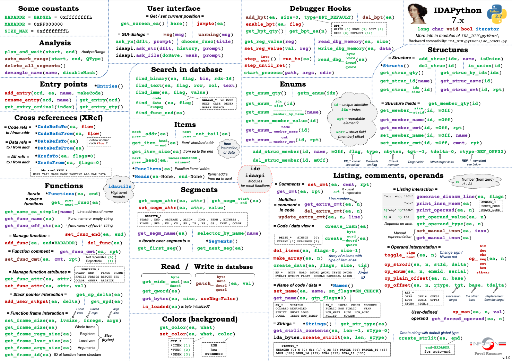

# idapython
从-1开始学习ida。
<!-- more -->
全部抄自《IDAPython 初学者指南》，手动翻译成了ida7.5+python3。
## 指令学习

### 节区操作
```python
ea = idc.get_screen_ea()
ea = here() # 函数获取当前地址
ida_ida.inf_get_min_ea()
ida_ida.inf_get_max_ea() # 获取当前文件的最大、小地址
idc.get_segm_name(ea) # get text
idc.GetDisasm(ea) # get disassembly
idc.print_insn_mnem(ea) # get mnemonic
idc.print_operand(ea, 0) # get first operand
idc.print_operand(ea, 1) # get second operand
```
一个例子
```sh
add rsp, 8
idc.print_insn_mnem(ea)   -->  add
idc.print_operand(ea, 0)  -->  rsp
idc.print_operand(ea, 1)  -->  8
```
有些时候我们必须确认一个地址是否在当前的程序中存在，那么我们可以使用idaapi.BADADDR 或者 BADADDR 来确认该地址。
```python
idaapi.BADADDR
if BADADDR != here(): print("valid address")

# 从遍历所有段
import idautils
for seg in idautils.Segments():
    print(idc.get_segm_name(seg),idc.get_segm_start(seg),idc.get_segm_end(seg))

idc.get_next_seg(ea) # 获取当前地址所在段的下一个段的起始地址
selector_by_name(".text") # 返回bas的值，也就是区段的序号
get_segm_by_sel(selector_by_name(".text")) # 组合技获得text段起始地址
```

### 函数
```python
# 何遍历所有的段中的所有函数
for func in idautils.Functions():
    print(hex(func), idc.get_func_name(func))

idc.get_func_name(func) # 通过某个地址获取函数的名称
func = idaapi.get_func(ea)
type(func) # <class 'idaapi.func_t'>
print("Start: 0x%x, End: 0x%x" % (func.start_ea,
func.end_ea)) # Start: 0xe79, End: 0x1078
dir(func) # 来获取这个类究竟有哪些属性可以使用
idc.get_next_func(ea)
idc.get_prev_func(ea) # 获取当前函数的前一个或者后一个函数
```

### 数据
```python
# 获取数据
# 获取当前函数的反汇编
start = idc.get_func_attr(ea, FUNCATTR_START)
end = idc.get_func_attr(ea, FUNCATTR_END) # 获取某个函数的首尾地址
cur_addr = start
while cur_addr <= end:
    print(hex(cur_addr), idc.GetDisasm(cur_addr))
    cur_addr = idc.next_head(cur_addr, end)
```
这种方法的一个缺陷是它依赖于指令被包含在函数开始和结束的边界内。打个比方说，函数内有个 ```jmp``` 指令，它跳转到比这个函数结束地址还要高的地址中去，意思是这个函数的所有指令可能并不是线性的，它可能会通过```jmp``` 跳出函数边界(起始地址和结束地址)，但其实这段指令仍是属于这个函数的，那么我们使用上述的方法就不能够遍历到该函数要执行的所有指令。这种跳转在代码混淆中非常的常见，所以说我们最好还是使用 ```idautils.FuncItems(ea)``` 来循环函数内的指令。

信息收集函数``` idc.get_func_attr(func, FUNCATTR_FLAGS) ```可以用来检索关于函数的信息，例如它是否是库中代码，或者函数是否有返回值等。对于一个函数来说有九个可能的标志。
```python
for func in idautils.Functions():
    flags = idc.get_func_attr(func, FUNCATTR_FLAGS)
    if flags & FUNC_NORET:
        print(hex(func), get_func_name(func), "FUNC_NORET")
    if flags & FUNC_FAR:
        print(hex(func), get_func_name(func),"FUNC_FAR")
    if flags & FUNC_LIB:
        print(hex(func), get_func_name(func),"FUNC_LIB")
    if flags & FUNC_STATIC:
        print(hex(func), get_func_name(func),"FUNC_STATIC")
    if flags & FUNC_FRAME:
        print(hex(func), get_func_name(func),"FUNC_FRAME")
    if flags & FUNC_USERFAR:
        print(hex(func), get_func_name(func),"FUNC_USERFAR")
    if flags & FUNC_HIDDEN:
        print(hex(func), get_func_name(func),"FUNC_HIDDEN")
    if flags & FUNC_THUNK:
        print(hex(func), get_func_name(func),"FUNC_THUNK")
    if flags & FUNC_LIB:
        print(hex(func), get_func_name(func),"FUNC_BOTTOMBP")
```
我们利用了 ```idautils.Fucntions()``` 来获取所有已知的函数首地址，然后利用```idc.get_func_attr(func, FUNCATTR_FLAGS)```获取标志。
### Flags
- FUNC_NORET：这个标志表示某个函数是否有返回值，它本身的值是 1，下面是一个没有返回值的函数，注意它没有函数的最后并不是 ```ret``` 或者 ```leave``` 指令。
- FUNC_FAR：这个标志非常少的出现，标志程序是否使用分段内存，它的值为 2。
- FUNC_USERFAR：少见+1
- FUNC_LIB：这个表示用于寻找库函数的代码。识别库函数代码是非常有必要的，因为我们在分析的时候一般将其跳过，它的值是 4。
一个FUNC_LIB的Demo:
```python
for func in idautils.Functions():
    flags = idc.get_func_attr(func, FUNCATTR_FLAGS)
    # print(get_func_name(func), hex(flags))
    if flags & FUNC_LIB:
        print(hex(func), "FUNC_LIB", get_func_name(func))
```
- FUNC_STATIC：静态函数
- FUNC_FRAME：这个标志表示函数是否使用了 ebp 寄存器(帧指针)，使用 ebp 寄存器的函数通常有如下的语法设定，目的是为了保存栈帧。
- FUNC_BOTTOMBP：和 FUNC_FRAME 一样，该标志用于跟踪帧指针(ebp)。它作用是识别函数中帧指针是 否等于堆栈指针(esp)。
- FUNC_HIDDEN：带有 FUNC_HIDDEN 标志的函数意味着它们是隐藏的，这个函数需要展开才能查看。如
果我们跳转到一个标记为 HIDDEN 的地址的话，它会自动的展开。
- FUNC_THUNK：表示这个函数是否是一个 thunk 函数，thunk 函数表示的是一个简单的跳转函数。
### 指令
获取该函数中所有指令地址的集合
```python
dism_addr = list(idautils.FuncItems(here()))
for line in dism_addr: 
    print(hex(line), idc.GetDisasm(line))
```

函数``` idautils.FuncItems(ea) ```实际上返回的是一个迭代器，但是我们将它强制转换为 list 类型。这个 list 以一种连续的方式存储着所有指令的起始地址。现在我们已经完全掌握了如何循环遍历程序中的段，函数和指令，那我们就开始 show 一个非常有用的例子。有时候我们会逆向一个加壳的代码，这时知道代码中哪里进行了动态调用对分析是非常有帮助的。一个动态的调用可能是由 ```call``` 或者 ```jump``` 加上一个操作数来实现的，比如说 ```call eax```，或者 ```jmp edi```。
```python
for func in idautils.Functions():
    flags = idc.get_func_attr(func, FUNCATTR_FLAGS)
    if flags & FUNC_LIB or flags & FUNC_THUNK:
        continue
    dism_addr = list(idautils.FuncItems(func))
    for line in dism_addr:
        m = idc.print_insn_mnem(line)
        if m == 'call' or m == 'jmp':
            op = idc.get_operand_type(line, 0)
            if op == o_reg:
                print("0x%x %s" % (line, idc.GetDisasm(line)))
```
我们使用 ```idautils.Functions()```获取所有的函数，然后利用 ```idc.get_func_attr(ea, FUNCATTR_FLAGS)```获取每个函数的标志，如果这个函数是库函数或者这个函数是 thunk 函数，那我们就跳过对它的处理，接下来我们使用 idautils.```FuncItems(ea)``` 获取函数中每个指定的起始地址。然后使用```idc.print_insn_mnem(ea)```来获取每条指令的操作符，判断操作符是否为 ```call``` 或者 ```jmp```。如果是的话，我们就使用 ```idc.get_operand_type(ea, n)```来获取操作数，这个函数返回的一个 opt.type 类型的数值(int 类型)，这个数值可表示的类型为寄存器，内存引用等等。我们检查每条 ```call``` 或者 ```jmp```指令的操作数，如果是寄存器的话就打印出该行指令。
通过强制转换为list我们获取了所有函数的地址，这样我们可以使用```idc.next_head```和```idc.prev_head```来获取附近指令的地址。注意，与之类似的```ida_bytes.next_addr```是获取附近的地址。
```python
ea = here()
print(hex(ea), idc.GetDisasm(ea))
next_instr = idc.next_head(ea)
print(hex(next_instr), idc.GetDisasm(next_instr))
```
### 操作数
我们可以使用 ```idc.get_operand_type(ea,n)```来获取操作数类型，ea 是一个地址，n 是一个索引。操作数总共有八种不同的类型。
- o_void：如果指令没有任何操作数，它将返回 0。例如```retn```
- o_reg：如果操作数是寄存器，则返回这种类型，它的值为 1
- o_mem：如果操作数是直接寻址的内存，那么返回这种类型，它的值是 2，这种类型对寻找 DATA的引用非常有帮助。例如 ```cmp ds:dword_A152B8, 0```
- o_phrase：如果操作数是利用基址寄存器和变址寄存器的寻址操作的话，那么返回该类型，值为 3。例如```mov [edi+ecx], eax```
- o_displ：如果操作数是利用寄存器和位移的寻址操作的话，返回该类型，值为 4。如```mov eax, [edi+18h]```
- o_imm；如果操作数是一个确定的数值的话，那么返回类型，值为 5，如 ```add esp, 0Ch```
- o_far：这种返回类型在 x86 和 x86_64 的逆向中不常见。它用来判断直接访问远端地址的操作数，值为 6
- o_near：这种返回类型在 x86 和 x86_64 的逆向中不常见。它用来判断直接访问近端地址的操作数，值为 7
#### 例子1
这个例子的目的是创建一个 python 的字典，字典包含了可执行文件中使用的所有偏移量，让偏移量作为字典的 key，而每个 key 对应的 value 存储着所有使用该偏移量的地址。
```python
import idautils
import idaapi
displace = {}
# for each known function
for func in idautils.Functions():
    flags = idc.get_func_attr(func, FUNCATTR_FLAGS)
    # skip library & thunk functions
    if flags & FUNC_LIB or flags & FUNC_THUNK:
        continue
    dism_addr = list(idautils.FuncItems(func))
    for curr_addr in dism_addr:
        op = None
        index = None
        insn = ida_ua.insn_t()
        # same as idc.GetOptype, just a different way of accessing the types
        idaapi.decode_insn(insn, curr_addr)
        if insn.Op1.type == idaapi.o_displ:
            op = 1
        if insn.Op2.type == idaapi.o_displ:
            op = 2
        if op == None:
            continue
        if "bp" in idc.print_operand(curr_addr,0) or idc.print_operand(curr_addr, 1):
        # ebp will return a negative number
            if op == 1:
                index = (~(int(insn.Op1.addr) - 1) &0xFFFFFFFF)
            else:
                index = (~(int(insn.Op2.addr) - 1) &0xFFFFFFFF)
        else:
            if op == 1:
                index = int(insn.Op1.addr)
            else:
                index = int(insn.Op2.addr)
        # create key for each unique displacement value
        if index:
            if index not in displace:
                displace[index] = []
            displace[index].append(curr_addr)
```
代码的最开始大家应该很熟悉了，我们利用了```idautils.Functions()```和```idc.get_func_attr(func, FUNCATTR_FLAGS)```来获取所有的函数，然后剔除掉其中库函数和trunk函数，随后我们又利用```idautils.FuncItems(ea)```来获取每个函数的指令。到这里我们使用了一个新函数```idaapi.decode_insn(insn, ea)```，这个函数需要传入我们想要解读的每个指令的开始地址。一旦这个指令成功的被解读，我们就可以通过```insn```来获取该指令的不同属性和参数。
```shell
Python>dir(insn)
['Op1', 'Op2', 'Op3', 'Op4', 'Op5', 'Op6', '__class__', '__delattr__', '__dict__', '__dir__', '__doc__', '__eq__', '__format__', '__ge__', '__get_auxpref__', '__get_operand__', '__get_ops__', '__getattribute__', '__getitem__', '__gt__', '__hash__', '__init__', '__init_subclass__', '__iter__', '__le__', '__lt__', '__module__', '__ne__', '__new__', '__reduce__', '__reduce_ex__', '__repr__', '__set_auxpref__', '__setattr__', '__sizeof__', '__str__', '__subclasshook__', '__swig_destroy__', '__weakref__', 'add_cref', 'add_dref', 'add_off_drefs', 'assign', 'auxpref', 'create_op_data', 'create_stkvar', 'cs', 'ea', 'flags', 'get_canon_feature', 'get_canon_mnem', 'get_next_byte', 'get_next_dword', 'get_next_qword', 'get_next_word', 'insnpref', 'ip', 'is_64bit', 'is_canon_insn', 'is_macro', 'itype', 'ops', 'segpref', 'size', 'this', 'thisown']
```
我们使用了 ```insn.Op1.type``` 来获取操作数的类型，需要注意的是这里操作数的起始索引并不是 ```idc.get_operand_type(ea,n)```中的 0，而是 1。然后我们用```idc.print_operand(ea, n)```检查两个操作数中哪个的类型是 o_displ。
我们已经获取了操作符的字符串表示，那么我们检查操作符中是否包含了“bp”字符串，这是一个快速判断操作符的中寄存器是否为 bp，```ebp``` 或 者 ```rbp``` 的方法。检查”bp”字符串的目的在于确定偏移量是否是一个负数。我们使用```insn.Op1.addr``` 来获取偏移量，这个方法会返回一个字符串。然后我们把他转换成为一个 integer 类型，如果需要的话把它转换为正数，然后我们把它放进脚本最开始定义的字典 display 中去。这样就完成了我们的操作，之后如果你想要查找使用某个偏移量的所有地址，请使用如下所示的代码即可：
```python
for x in displace[0x130]: 
    print(hex(x), GetDisasm(x))
```
#### 例子2
有时候我们在逆向分析一个可执行文件的内存转储的时候，有些操作数就不是一个偏移量了。看如下代码：
```yml
seg000:00BC1388 push 0Ch
seg000:00BC138A push 0BC10B8h
seg000:00BC138F push [esp+10h+arg_0]
seg000:00BC1393 call ds:_strnicmp
```
第二个被 push 的值是一个存在内存中的偏移。如果我们通过右键把这个偏移定义为data 类型，我们可以看到这个偏移其实是一个字符串(就是程序里静态的字符串)，当然完成这个定义操作很简单，但是，你懂的，有时候这种操作太多了话就需要写一个脚本来自动完成这件事情的说。
```python
min = ida_ida.inf_get_min_ea()
max = ida_ida.inf_get_max_ea()
# for each known function
for func in idautils.Functions():
    flags = idc.get_func_attr(func, FUNCATTR_FLAGS)
    # skip library & thunk functions
    if flags & FUNC_LIB or flags & FUNC_THUNK:
        continue
    dism_addr = list(idautils.FuncItems(func))
    for curr_addr in dism_addr:
        if idc.get_operand_type(curr_addr, 0) == 5 and (min < idc.get_operand_value(curr_addr,0) < max):
            idc.op_plain_offset(curr_addr, 0, 0)
        if idc.get_operand_type(curr_addr, 1) == 5 and (min < idc.get_operand_value(curr_addr,1) < max):
            idc.op_plain_offset(curr_addr, 1, 0)
```
做完如上操作我们可以看到代码变成了如下的状态：
```yml
seg000:00BC1388 push 0Ch
seg000:00BC138A push offset aNtoskrnl_exe ;
"ntoskrnl.exe"
seg000:00BC138F push [esp+10h+arg_0]
seg000:00BC1393 call ds:_strnicmp
```
脚本的开始通过 ```ida_ida.inf_get_min_ea()```和 ```ida_ida.inf_get_max_ea()```获取可执行文件的最大地址和最小地址，我们遍历了所有的函数和指令。对于每条指令我们检查他的操作数类型是否为 o_imm(值为 5)，o_imm 类型的操作数就是一个确定的数值或者偏移，一旦这个发现这种类型的操作数，我们利用 ```idc.get_operand_value(ea, n)```来获取它的值，然后检测一下是否在可执行文件的最大地址和最小地址中。最后我们利用 ```idc.get_operand_type(ea, n, base)```来将操作数转换成为一个偏移，该函数的第一个参数为地址，第二个参数为操作数的索引，第三个参数为基地址，在该例子中我们只需要将其设为 0 即可。

### 交叉引用(Xrefs)
能够定位 data 段和 code 段的交叉引用是非常重要的，交叉引用的重要性在于它能够提供某个确定的数据或者某个函数被调用的位置。举个栗子，如果我们想要知道哪些地址调用了 ```WriteFile()```函数，我们所要做的就是在导入表中找到 ```WriteFile()```函数，然后查看其交叉引用即可。
```python
wf_addr = idc.get_name_ea_simple("_puts")
print(hex(wf_addr), idc.GetDisasm(wf_addr))
# 0x202150 extrn puts:near
for addr in idautils.CodeRefsTo(wf_addr, 0):
    print(hex(addr), idc.GetDisasm(addr))
# 打印出该 API 的所有交叉引用
```
我们可以通过调用 ```idautils.Names()```函数来获取在 IDA 中任何 API 和被重命名的函数的相关信息，该函数将返回一个类型为(ea, str_name)的元组。

函数```idautils.DataRefsTo(ea)```只有一个地址参数，它返回该数据地址的所有交叉引用(迭代器)。

**重点来了！！！**

这里我们使用前面所提到的有一种更加通用的方法来获取交叉引用，该方法调用两个函数就能完成获取所有交叉引用地址和调用地址的效果，这两个函数就是 ```idautils.XrefsTo(ea, flags=0)```和 ```idautils.XrefsFrom(ea, flags=0)```
```python
for xref in idautils.XrefsTo(ea, 1):
    print(xref.type, idautils.XrefTypeName(xref.type), hex(xref.frm), hex(xref.to), xref.iscode)
```
对于刚刚的extern，我们可以这样
```python
print(hex(xref.frm), idc.GetDisasm(xref.frm))
# 0x201f80 dq offset puts
```
获得的其实是puts的got表地址。跳转到got表再次使用上面的代码，我们得到了puts的plt表，再使用就获得了所有的```call puts```了。这可以给我们提供一个思路去检索我们想要的危险函数调用。

回到正题，第一行显示了一个<Path>字符串的的地址，我们使用```idautils.XrefsTo(ea,1)```来获取该字符串的所有交叉引用。我们使用xref.type来指明该交叉引用的类型，```idautils.XrefTypeName(xref.type)```用来打印表示该类型的含义，这其中有十二种不同的类型。
```js
0 = 'Data_Unknown'
1 = 'Data_Offset'
2 = 'Data_Write'
3 = 'Data_Read'
4 = 'Data_Text'
5 = 'Data_Informational'
16 = 'Code_Far_Call'
17 = 'Code_Near_Call'
18 = 'Code_Far_Jump'
19 = 'Code_Near_Jump'
20 = 'Code_User'
21 = 'Ordinary_Flow'
```
xref.frm 打印出该地址的交叉引用，xref.to 打印出改地址本身，xref.iscode 打印出该交叉引用是否在代码段中，上述的代码我们使用了 idautils.XrefsTo(ea, 1)并将其 flag 位设为了1，如果我们将 flag 设为 0 的话，那么它将会显示该地址的任意交叉引用，举个栗子：
```yml
.text:1000AAF6 jnb short loc_1000AB02 ; XREF
.text:1000AAF8 mov eax, [ebx+0Ch]
.text:1000AAFB mov ecx, [esi]
.text:1000AAFD sub eax, edi
.text:1000AAFF mov [edi+ecx], eax
.text:1000AB02
.text:1000AB02 loc_1000AB02: ; ea is here()
.text:1000AB02 mov byte ptr [ebx],
```
很显然AAF6引用了ea，但是如果flag为0的话结果还会有AAFF也就是程序正常执行流。

这种方法对于我们自己命名的也有用。
```python
idc.set_name(ea, "RtlCompareMemory", SN_CHECK)
for xref in idautils.XrefsTo(ea, 1):
    print(xref.type, idautils.XrefTypeName(xref.type), hex(xref.frm), hex(xref.to), xref.iscode)
```
当然打印所有的交叉引用可能会感觉有点儿重复的说。
```sh
Python>print hex(ea), idc.GetDisasm(ea)
0xa21138 extrn GetProcessHeap:dword
Python>for xref in idautils.XrefsTo(ea, 1):
    print xref.type, idautils.XrefTypeName(xref.type), hex(xref.frm), hex(xref.to), xref.iscode
Python>
17 Code_Near_Call 0xa143b0 0xa21138 1
17 Code_Near_Call 0xa1bb1b 0xa21138 1
3 Data_Read 0xa143b0 0xa21138 0
3 Data_Read 0xa1bb1b 0xa21138 0
Python>print(idc.GetDisasm(0xa143b0))
call ds:GetProcessHeap
```
重复性来自于 Data_Read 和 Code_Near 类型的交叉引用都被识别出来，所以下面利用set 的方法可以 精简一下这些地址：
```python
def get_to_xrefs(ea):
    xref_set = set([])
    for xref in idautils.XrefsTo(ea, 1):
        xref_set.add(xref.frm)
    return xref_set

def get_frm_xrefs(ea):
    xref_set = set([])
    for xref in idautils.XrefsFrom(ea, 1):
        xref_set.add(xref.to)
    return xref_set
```
精简后的例子：
```sh
Python>print(hex(ea), idc.GetDisasm(ea))
0xa21138 extrn GetProcessHeap:dword
Python>get_to_xrefs(ea)
set([10568624, 10599195])
Python>[hex(x) for x in get_to_xrefs(ea)]
['0xa143b0', '0xa1bb1b']
```

### 搜索
我们其实已经能够通过遍历所有已知的函数及其指令来达到一种基本的搜索效果，这当然很有用，但是有时候我们需要搜索一些特定的字节，比如说 0x55,0x8b,0xec 这种字节序列，这 3 个字节其实代表的汇编代码为 ```push ebp, mov ebp, esp``` 。所以我们可以使用```idc.FindBinary(ea,flag, searchstr, radix=16)```来实行字节或者二进制的搜索。ea 代表啥就不说了，flag 代表搜索方向或者条件。
```js
SEARCH_UP = 0
SEARCH_DOWN = 1
SEARCH_NEXT = 2
SEARCH_CASE = 4
SEARCH_REGEX = 8
SEARCH_NOBRK = 16
SEARCH_NOSHOW = 32
SEARCH_UNICODE = 64 
SEARCH_IDENT = 128 
SEARCH_BRK = 256 
```
上面的类型不必要都看一遍，但是还是要看看一些常用的类型：
- SEARCH_UP 和 SEARCH_DOWN 用来指明搜索的方向
- SEARCH_NEXT 用来获取下一个已经找到的对象
- SEARCH_CASE 用来指明是否区分大小写
- SEARCH_NOSHOW 用来指明是否显示搜索的进度
- SEARCH_UNICODE 用于将所有搜索字符串视为 Unicode

```python
pattern = '55 48 89 E5'
addr = ida_ida.inf_get_min_ea()
for x in range(0,5):
    addr = idc.find_binary(addr, SEARCH_DOWN|SEARCH_NEXT, pattern)
    if addr != idc.BADADDR:
        print(hex(addr), idc.GetDisasm(addr))
```
结果：
```yml
Python>
0x911 push    rbp
0x940 push    rbp
0x94a push    rbp
0x9ea push    rbp
0xa84 push    rbp
```
第一行我们定义了要搜索的形式，搜索形式可以是 16 进制格式，比如 ```0x55 0x8B 0xEC```和 ```55 8B EC``` 都是可以的，```\x55\x8B\xEC``` 这种格式可不行，除非你使用 ```idc.find_text(ea, flag, y, x, searchstr)```这个函数。```ida_ida.inf_get_min_ea()```用来获取可执行文件的最开始的地址，接下来我们将```idc.find_binary(ea, flag,searchstr, radix=16)```的返回结果设置为 addr 变量。在搜索时最重要的是验证结果是否符合预期，首先我们将地址与 ```idc.BADADDR``` 进行比较，然后打印出该地址和该地址的反汇编结果。

搜索字节序列是很有用的，但是有时候我们想要查找类似于“chrome.dll”这样的字符串。我们可以利用 ```hex(y)```函数来将“chrome.dll”字符串转换成为 16 进制的字节序列，但是，太蠢了，如果字符串是 unicode 格式呢，你还得重新考虑了，好了，不瞒各位，最好的方法是```find_text(ea,flag, y, x, searchstr) ```。这个函数看起来是不是很熟悉，因为它很像函数```idc.find_binary``` 的说，参数里面，ea 是地址，flag 是搜索方向和搜索类型。y 是从 ea 开始搜索的行数，x 是行中的坐标。这两个参数通常置 0，现在我们开始查找字符串“Accept”的出现的次数。当然你可以换换其他的字符串，可以从字符串窗口(shift+F12)获得。
```python
cur_addr = ida_ida.inf_get_min_ea()
end = ida_ida.inf_get_max_ea()
while cur_addr < end:
    cur_addr = idc.find_text(cur_addr, SEARCH_DOWN, 0, 0,
"Exit")
    if cur_addr == idc.BADADDR:
        break
    else:
        print(hex(cur_addr), idc.GetDisasm(cur_addr))
    cur_addr = idc.next_head(cur_addr)
```
结果：
```sh
Python>
0x408 Elf64_Sym <offset aExit - offset byte_468, 12h, 0, 0, offset dword_0, \; "exit"
0x473 db 'exit',0
0x760 Elf64_Rela <201FB8h, 0E00000007h, 0>; R_X86_64_JUMP_SLOT exit
0x820 jmp     cs:exit_ptr
0xa49 call    _exit
0xafd lea     rdi, a3Exit; "3.Exit"
0xb75 call    _exit
0xbaf call    _exit
0xc99 call    _exit
0xcf2 push    rbp
0xd1e leave
0xd1f retn
```
我们利用 ```ida_ida.inf_get_min_ea()```来获取可执行文件的最小地址， 将其赋给 cur_addr。利用 ```ida_ida.inf_get_max_ea()```赋值给 end。因为不知道该字符串出现的次数，所以我们从上往下搜索直到最大地址。我们把```idc.find_text``` 的返回值赋给 cur_addr。因为我们利用了 ```idc.next_head(ea)```使当前地址不断增长，所以就不需要在 ```idc.find_text()```中添加 SEARCH_NEXT 的标志。为什么我们要手动的增加地址呢，因为一行字符串中可能出现多次要查找的字符串，往上翻认真阅读 SEARCH_NEXT的标志的意思，你就发现不手动的话会陷入一个死循环(但是测试的时候，算了你们自己测吧，估计我测的有问题)。

除了以上述描述的搜索方式以为，还有一系列的函数用来查找其他类型。通过这写 API的名称就能容易的识别出它们的功能，在讨论查找其他类型之前我们首先来看一下如何通过地址来识别他们的类型，IDAPython 中有如下的一些函数用来判断一个地址的类型，这些APIs 返回的是 bool 值 True 或者 False。
- ida_bytes.is_code(f)：判断 IDA 是否将其判定为代码
- ida_bytes.is_data(f)：判断 IDA 是否将其判定为数据
- ida_bytes.is_tail(f)：判断 IDA 是否将其判定为尾部
- ida_bytes.is_unknown(f)：判断 IDA 是否将其判定为未知，即既不是数据，也不是代码
- ida_bytes.is_head(f)：判断 IDA 是否将其判定为头部

f 这个参数是新出现的，相比起于传递地址，我们还要先通过 ```	ida_bytes.get_full_flags(ea)```获取地址的内
部标志表示，然后再传给 idc.is 系列函数当参数，代码如下：
```sh
idc.is_code(ida_bytes.get_full_flags(ea))
```
- ida_search.find_code(ea, flag)：该函数用来寻找被标志为代码的下一个地址

这对我们想要查找数据块的末尾是很有帮助的。如果 ea 是代码地址，那么该函数返回下一个代码地址，flag 参数看前面的 ```idc.find_text```就可以了。例子：
```python
Python>print(hex(ea), idc.GetDisasm(ea))
0x4140e8 dd offset dword_4140EC
Python>addr = ida_wearch.find_code(ea, SEARCH_DOWN|SEARCH_NEXT)
Python>print(hex(addr), idc.GetDisasm(addr))
0x41410c push ebx
```
可以看到0x4140e8是某个数据的地址。我们将```idc.find_code(ea,SEARCH_DOWN|SEARCH_NEXT)```的返回值赋给addr，然后打印出该地址和它的反汇编代码。通过该函数我们直接跳过了36个字节获取到了代码段的首地址。
- ida_search.find_data：该函数和上一个函数 FindCode()差不多，除了它返回的是数据段的地址

我们反转一下上一个场景，然后通过代码段地址去寻找数据段首地址，代码如下
```sh
Python>print(hex(ea), idc.GetDisasm(ea))
0x41410c push ebx
Python>addr = ida_search.find_data(ea, SEARCH_UP|SEARCH_NEXT)
Python>print(hex(addr), idc.GetDisasm(addr))
0x4140ec dd 49540E0Eh, 746E6564h, 4570614Dh, 7972746Eh, 8, 1,4010BCh
```
- ida_search.find_unknown(ea, flag):该功能用于查找 IDA 未识别为代码或数据的字节地址

未知类型需要通过观察或脚本进一步手动分析。
```sh
Python>print(hex(ea), idc.GetDisasm(ea))
0x406a05 jge short loc_406A3A
Python>addr = ida_search.find_unknown(ea, SEARCH_DOWN)
Python>print(hex(addr), idc.GetDisasm(addr))
0x41b004 db 0DFh ; ?
```
- ida_search.find_defined：它用于查找 IDA 标识为代码或数据的地址，配合交叉引用效果更佳。
```sh
0x41b900 db ? ;
Python>addr = ida_search.find_defined(ea, SEARCH_UP)
Python>print(hex(addr), idc.GetDisasm(addr))
0x41b5f4 dd ?
Python>for xref in idautils.XrefsTo(addr, 1):
print(hex(xref.frm), idc.GetDisasm(xref.frm))
Python>
0x4069c3 mov eax, dword_41B5F4[ecx*4]
```
- ida_search.find_imm：相比于寻找一些类型，我们有些时候其实更希望能够找到特定的值，举个栗子，你感觉代码里面肯定是用了 rand()函数来产生随机数的，但是你就是找不到它，咋办？如果我们直到这个 rand()函数采用了 0x343fd 作为种子那么我们就可以去寻找这个数值
```sh
Python>addr = ida_search.find_imm(ida_ida.inf_get_min_ea(), SEARCH_DOWN, 0x343FD )
Python>addr
[268453092, 0]
Python>print("0x%x %s %x" % (addr[0], idc.GetDisasm(addr[0]),
addr[1] ))
0x100044e4 imul eax, 343FDh 0
```
第一行我们得到传递最小地址作为参数，SEARCH_DOWN 为 flag，0x343fd 作为查找的值。不像前几个函数返回地址，ida_search.find_imm 返回一个元组，元组的第一项为地址，第二项为标识是第几个操作数。这里操作数的算法和 idc.GetOpnd 一样，也是从 0 开始的。我们打印出改地址和反汇编代码可以看出，0x343FD 是作为第二个操作数。如果我们想查找所有的立即数的使用的话可以利用如下的代码：(感觉上面的代码有问题+_+，那个addr[1]的值应该是 1)
```python
addr = ida_ida.inf_get_min_ea()
while True:
    addr, operand = ida_search.find_imm(addr,SEARCH_DOWN|SEARCH_NEXT, 0x7a )
    if addr != BADADDR:
        print(hex(addr), idc.GetDisasm(addr), "Operand ", operand)
    else:
        break
```
结果

```sh
Python>
0xef9 db  7Ah ; z Operand  0
0xf29 db  7Ah ; z Operand  0
```
**上述大部分代码看起来很熟悉，但是因为搜索不止一个值，循环的时候需要使用SEARCH_ DOWN|SEARCH_NEXT 标志。**

### 数据选取
有时候我们并不是只想写自动查找数据和代码的脚本，也许你已经知道了代码或者数据的地址，你现在想选取它们分析一下。可能我们只是想要把突出某些代码然后在这些代码上面利用 IDAPython 进行工作。为了获得选定数据的边界，我们可以使用 ```idc.read_selection_start()```来获取开始地址和 ```idc.read_selection_end()```来获得结束地址，不举例了。

注意在分析 64 位可执行文件的时候容易出错，因为 64 位地址容易导致整数 integer 的溢出。

### 注释和重命名
我们使用 ```idc.set_cmt(ea, comment, 0)```来增加注释，```idc.set_cmt(ea, comment, 1)```来增加重复性注释，ea 是要添加注释的地址。下面代码在一条指令(用 XOR 清零寄存器)出现的时候自动增加注释。
```python
for func in idautils.Functions():
    flags = idc.get_func_attr(func, FUNCATTR_FLAGS)
    # skip library & thunk functions
    if flags & FUNC_LIB or flags & FUNC_THUNK:
        continue
    dism_addr = list(idautils.FuncItems(func))
    for ea in dism_addr:
        if idc.print_insn_mnem(ea) == "xor":
            if idc.print_operand(ea, 0) == idc.print_operand(ea, 1):
                print(hex(ea), idc.GetDisasm(ea))
                comment = "%s = 0" % (idc.print_operand(ea,0))
                idc.set_cmt(ea, comment, 0)
```

如前所述，我们通过调用 ```idautils.Functions()```来循环遍历所有函数，并通过调用 ```list(idautils. FuncItems(func))```遍历所有指令。然后利用 ```idc.print_insn_mnem(ea)```获取操作符，并判断是否为 XOR。然后利用 ```idc.print_operand(ea, n)```判断两个操作数是否相等，如果是的话，那么给它加上常规注释。
```yml
.text:000000D90   xor  ebp, ebp ; ebp = 0
```

如果要增加重复性注释，那么我们使用 ```idc.set_cmt(ea, comment, 1) ```。 这样做好像更有用一点，因为我们可以看到一些分支做了清零，就像是返回 0 的操作。要获取一个注释我们可以使用 ```ida_bytes.get_cmt(ea, repeatable)```该函数，ea 是地址，repeatable 是 bool 值。要获取上述的注释，我们可以使用如下的代码：
```python
ida_bytes.get_cmt(ea, False)
```

如果要获取重复性注释使用 ```ida_bytes.get_cmt(ea, True)```就可以了。当然不只是指令可以做注释，函数也可以做注释的说，我们利用 ```idc.set_func_cmt(ea, cmt, repeatable)```注释函数和利用 ```idc.get_func_cmt(ea, repeatable)```获取函数的注释。ea 可以是函数中的任何地址，cmt 是我们要添加的注释，repeatable 同上面一样。将函数的注释标记为可重复性的话，那么它会在任何调用该函数的地方增加注释。
```python
Python>idc.get_func_name(ea)
done
Python>idc.set_func_cmt(ea, "done", 1)
True
```
第一行我们打印函数的名字，然后我们利用```idc.set_func_cmt(ea, comment, repeatable)```来设置一个可重复性注释（check out later）给该函数。如果我们去观察函数的起始地址就可以发现我们增加的注释。因为函数的注释是可重复性的，所以函数的交叉引用地方我们同样能看到注释。这样的话就能够很好的提示我们函数的功能。

重命名函数和地址是一项非常常见的自动化任务，特别是在一些于地址无关代码（PIC），加壳或者封装函数中，因为在 PIC 代码和脱壳代码中，导入表可能并不存在于转储中。而封装函数的功能只是简单的调用 API 而已。
```python
idc.set_name(ea, "func_name", SN_CHECK)
```

要重命名一个操作数，我们需要拿到它的地址先，比如在 ```004047B0``` 有一个双字我们想要重命名：
```yml
.text:004047AD lea ecx, [ecx+0]
.text:004047B0 mov eax, dword_41400C
.text:004047B6 mov ecx, [edi+4BCh]
```
要获取操作数的数值我们可以使用 ```get_operand_value(ea, n) ```

```sh
Python>print(hex(ea), idc.GetDisasm(ea))
0x4047b0 mov eax, dword_41400C
Python>op = idc.get_operand_value(ea,1)
Python>print(hex(op), idc.GetDisasm(op))
0x41400c dd 2
Python>idc.set_name(op, "BETA", SN_CHECK)
True
Python>print(hex(ea), idc.GetDisasm(ea))
0x4047b0 mov eax, BETA[esi]
```

第一行我们打印了当前地址信息，然后我们把第二个操作数```dword_41400C```赋值给op，然后使用 ```idc.set_name(op, "name, SN_CHECK)```进行重命名，最后打印出新的被重命名的名字。

好了，既然我们现在基础已经很好了，我们现在就用我们所学的来自动化命名封装函数。请注意注释的意思来保证你能够理解代码逻辑。

```python
import idautils
def rename_wrapper(name, func_addr):
    if idc.set_name(func_addr, name, SN_NOWARN):
        print("Function at 0x%x renamed %s" %( func_addr,idc.get_func_name(func)))
    else:
        print("Rename at 0x%x failed. Function %s is being used."% (func_addr, name))
    return
def check_for_wrapper(func):
    flags = idc.get_func_attr(func, FUNCATTR_FLAGS)
    # skip library & thunk functions
    if flags & FUNC_LIB or flags & FUNC_THUNK:
        return
    dism_addr = list(idautils.FuncItems(func))
    # get length of the function
    func_length = len(dism_addr)
    # if over 32 lines of instruction return
    if func_length > 64:
        print("over 64 lines of instruction return, func_len is 0x%x." % func_length)
        return
    func_call = 0
    instr_cmp = 0
    op = None
    op_addr = None
    op_type = None
    # for each instruction in the function
    for ea in dism_addr:
        m = idc.print_insn_mnem(ea)
        if m == 'call' or m == 'jmp':
            if m == 'jmp':
                temp = idc.get_operand_value(ea,0)
                # ignore jump conditions within the function boundaries
                if temp in dism_addr:
                    print("jump conditions within the function boundaries")
                    continue
            func_call += 1
            # wrappers should not contain multiple function calls
            if func_call == 2:
                print("wrappers contain multiple function calls")
                return
            op_addr = idc.get_operand_value(ea , 0)
            op_type = idc.get_operand_type(ea,0)
        elif m == 'cmp' or m == 'test':
            # wrappers functions should not contain much logic.
            instr_cmp += 1
            if instr_cmp == 3:
                print("wrappers functions contain so much logic")
                return
        else:
            continue
    # all instructions in the function have been analyzed
    if op_addr == None:
        return
    name = idc.get_name(op_addr, ida_name.GN_VISIBLE)
    # skip mangled function names
    if "[" in name or "$" in name or "?" in name or "@" in name or name == "":
        print("mangled function names")
        return
    name = "w_" + name
    if op_type == 7:
        if idc.get_func_attr(op_addr, FUNCATTR_FLAGS) & FUNC_THUNK:
            rename_wrapper(name, func)
            return
    if op_type == 2 or op_type == 6:
        rename_wrapper(name, func)
        return

for func in idautils.Functions():
    check_for_wrapper(func)
```

所有的代码都很熟悉，但是值得注意的是 rename_wrapper 中的 ```idc.set_name(ea, name, flag)```用法，因为使用 ```idc.set_name(ea, name, SN_CHECK)``` 的话，如果某一个函数名称已经被使用了，那么ida 会抛出一个警告的对话。为了跳过该对话框，我们将 flag 的值设置为 256 或者SN_NOWARN 即可。我们可以应用一些逻辑来将函数重命名为 w_HeapFree_1 等，但为简洁起见，我们会将其忽略。

### 访问原始数据
在逆向工程中获取原始数据是非常重要的。原始数据是 16 进制的字节，它们被解释为数据或者代码，ida 中我们可以在反汇编代码窗口的左侧看到这些原始数据。

要获取原始数据的话我们首先要指定获取的单元大小，这些获取原始数据 API 的命名规则就是以单元大小。我们使用 ```idc.get_wide_byte(ea)```获取单字节，```idc.get_wide_word(ea)```获取字等等。

### 补丁
有时候我们在逆向一个恶意软件的时候，样本会有被加密的字符串。这会阻碍我们分析的过程和组织我们通过字符串来定位关键点。这种情况下给 idb 文件打补丁就很有用了。重命名地址但是好像并没有卵用，因为命名是有约束限制的，所以我们需要给某些地址做patch了，我们可以使用如下的函数来 patch：
- ida_bytes.patch_byte(ea, value)
- ida_bytes.patch_word(ea, value)
- ida_bytes.patch_dword(ea, value)
- ida_bytes.patch_qword(ea, value)

逆向的基操，懒得举例了。

剩下三个自己看看吧，写不动了。